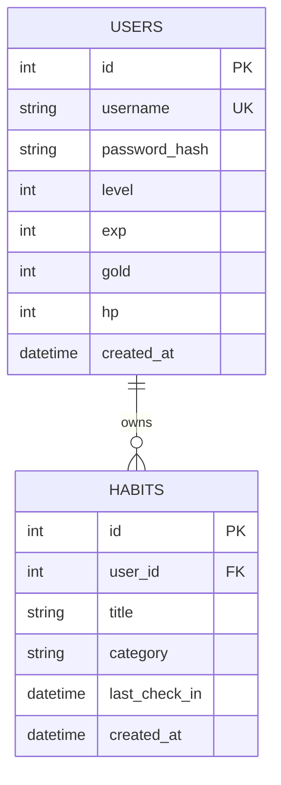

# Habit Life RPG Database Schema

版本：Chapter 4 Foundation  
狀態：資料庫綱要藍圖  
對應書稿：第 4.2 節「資料庫綱要與密碼資安」

## 1. 文件目的

本文件定義 `Habit Life RPG` MVP 的資料模型、安全底線與資料庫設計原則。第四章只寫綱要，不建立實體 database、migration 或 ORM model。

MVP 先使用關聯式資料模型，核心資料表只有 `Users` 與 `Habits`。第 5 章會先用 SQLite 在本機跑通，到了第 8 章再把資料層升級到 Azure SQL。

## 2. 為什麼選 SQL

本專案有明確的帳號、習慣、歸屬與打卡規則，因此適合關聯式資料庫。

SQL 適合本案的理由：

- 使用者與 habit 有明確一對多關係。
- 打卡會更新使用者數值與 habit 狀態，需要一致性。
- API、測試與 OpenAPI 契約都需要穩定欄位。
- AI 在有清楚表結構、主鍵、外鍵時比較不容易命名漂移。

NoSQL 並非不好，但不是本書主線最適合的教學選擇。

## 3. 正規化原則

MVP 採用夠用、不過度切碎的資料模型：

- 使用者資料放在 `Users`。
- 習慣資料放在 `Habits`。
- 玩家等級、EXP、gold、HP 只放在 `Users`。
- habit 的同日打卡狀態先用 `Habits.last_check_in` 支撐。
- 不在 MVP 階段建立 `Checkins` 歷史表。

未來如果需要完整打卡歷史、統計圖、連續紀錄或日曆檢視，再新增 `Checkins` 表。

## 4. ERD

## 5. Users

`Users` 保存玩家身分與角色狀態。

| 欄位 | 型別 | 約束 | 說明 |
| :--- | :--- | :--- | :--- |
| `id` | integer | primary key | 使用者識別碼 |
| `username` | string | required, unique | 登入名稱，不可重複 |
| `password_hash` | string | required | 雜湊後的密碼，不可存明文密碼 |
| `level` | integer | required, default `1` | 玩家目前等級 |
| `exp` | integer | required, default `0` | 玩家目前經驗值 |
| `gold` | integer | required, default `0` | 玩家目前金幣 |
| `hp` | integer | required, default `100` | 玩家目前 HP，支援懲罰機制 |
| `created_at` | datetime | required | 建立時間 |

### Users 索引

| 索引 | 欄位 | 理由 |
| :--- | :--- | :--- |
| `pk_users_id` | `id` | 主鍵查詢 |
| `uq_users_username` | `username` | 登入與註冊時避免帳號重複 |

## 6. Habits

`Habits` 保存使用者建立的習慣項目。

| 欄位 | 型別 | 約束 | 說明 |
| :--- | :--- | :--- | :--- |
| `id` | integer | primary key | habit 識別碼 |
| `user_id` | integer | required, foreign key | habit 所屬使用者 |
| `title` | string | required | habit 名稱 |
| `category` | string | optional | habit 類別，例如 Mind、Body、Craft |
| `last_check_in` | datetime | nullable | 最近一次打卡時間，MVP 用於同日不可重複打卡 |
| `created_at` | datetime | required | 建立時間 |

### Habits 索引

| 索引 | 欄位 | 理由 |
| :--- | :--- | :--- |
| `pk_habits_id` | `id` | 主鍵查詢 |
| `ix_habits_user_id` | `user_id` | 查詢某位使用者的 habits |
| `ix_habits_user_id_last_check_in` | `user_id`, `last_check_in` | 支援打卡時檢查同日狀態 |

## 7. 關聯與刪除策略

- 一位使用者可以擁有多個 habits。
- 每個 habit 必須屬於一位使用者。
- MVP 階段若刪除使用者，該使用者的 habits 應一起移除。
- 第 5 章若先用 SQLite 實作，必須確認 foreign key 行為在連線時啟用。

## 8. 同日不可重複打卡

MVP 使用 `Habits.last_check_in` 支撐同日不可重複打卡。

判定流程：

1. 讀取 `habit_id` 對應的 habit。
2. 確認 `habit.user_id` 等於目前登入使用者。
3. 若 `last_check_in` 已經是今天，拒絕並回傳 `400 Bad Request`。
4. 若尚未打卡，更新 `last_check_in`，並更新 `Users.exp`、`Users.gold`、`Users.level`。

此設計不保留完整打卡歷史。這是 MVP 取捨，不是最終限制。

## 9. 密碼資安底線

資料庫永遠不可保存明文密碼。

必須遵守：

- 不建立 `password` 欄位保存明文。
- 只保存 `password_hash`。
- 雜湊演算法需支援 salt。
- 登入時使用密碼驗證函式比較輸入密碼與 `password_hash`。
- 不把測試用真密碼、JWT secret 或資料庫連線字串提交到 Git。

第 5 章實作登入或註冊時，若 AI 產生任何把明文密碼寫進資料庫的程式碼，必須退回修改。

## 10. 未來擴充點

本章刻意不加入以下表格，但保留未來擴充方向：

| 未來資料表 | 何時需要 | 說明 |
| :--- | :--- | :--- |
| `Checkins` | 需要完整打卡歷史 | 保存每次打卡時間與獎勵結果 |
| `Achievements` | 需要成就系統 | 保存玩家解鎖條件與狀態 |
| `Bosses` | 需要 BOSS 戰 | 保存 BOSS 血量、挑戰條件與戰鬥結果 |
| `HabitStats` | 需要報表或趨勢圖 | 保存統計或快取結果 |

## 11. 第四章邊界

本文件是資料庫設計藍圖，不是 migration 檔。

第四章不建立：

- SQLite `.db` 檔案。
- SQL DDL 腳本。
- SQLAlchemy ORM class。
- Alembic migration。
- seed data。

這些會在第 5 章後端實作時依本文件逐步建立。
