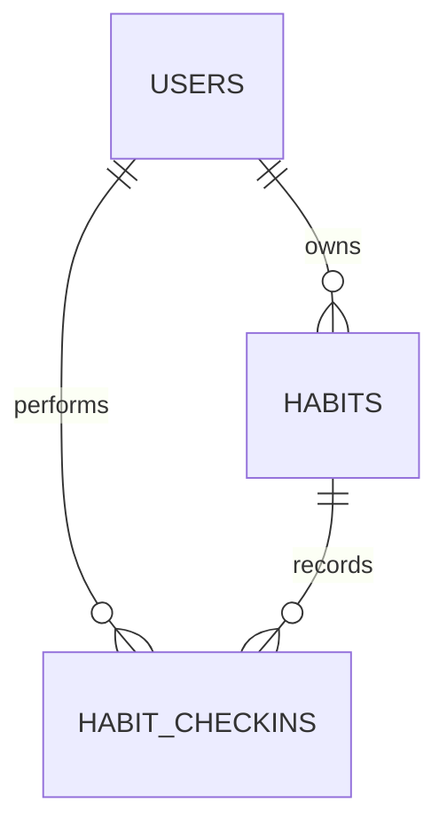

# Habit Life RPG Database Schema

## ERD



## Users

保存帳號與角色摘要。`username_normalized` 使用唯一約束避免大小寫變形造成重複帳號；`password_hash` 只能保存 Argon2 雜湊。

## Habits

保存使用者習慣、優先級、封存狀態、目前 streak 與最後打卡日期。`priority` 使用 `high`、`medium`、`low` 字串，預設為 `medium`，並以資料庫檢查約束阻止其他值。`ix_habits_user_active` 支援 Dashboard 常用查詢。

## HabitCheckins

每次成功打卡建立不可重複的歷史紀錄。`uq_habit_checkin_day` 唯一約束 `(habit_id, checkin_date)`，是並行請求下阻止重複獎勵的最終防線。

## Migration

Alembic 是建立與升級正式 schema 的唯一流程：

```bash
alembic upgrade head
```

測試可對暫存 SQLite database 執行相同 migration。其他資料庫環境也應沿用同一條migration歷史，不另外維護一份容易漂移的手寫schema。
