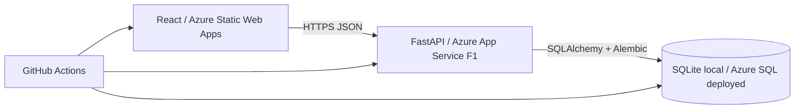

# Habit Life RPG System Architecture

## 元件

- React 只管理互動與顯示，不計算獎勵。
- FastAPI 驗證 JWT、資料所有權、日期與商業規則。
- SQLite 讓讀者本機零設定啟動；Azure SQL 是正式教學部署資料庫。
- SQLAlchemy 模型與 Alembic migration 是兩個環境的共同契約。
- GitHub Actions 在部署前執行後端、前端與契約測試。

## 信任邊界

- 瀏覽器輸入一律不可信。
- JWT 只證明身分，Habit 查詢仍必須包含 `user_id`。
- Secret 只存在 `.env`、GitHub Environment 或 Azure App Settings。
- CORS 只列出本機開發來源與最後部署的 Static Web Apps 來源。

## 章節演進

第 4 章固定資料與 API 契約；第 5 章實作 FastAPI；第 6 章建立品質防線；第 7 章建立 React；第 8 章才建立 Azure 資源。
