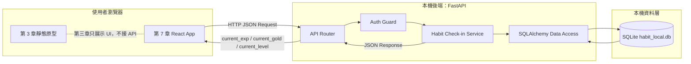
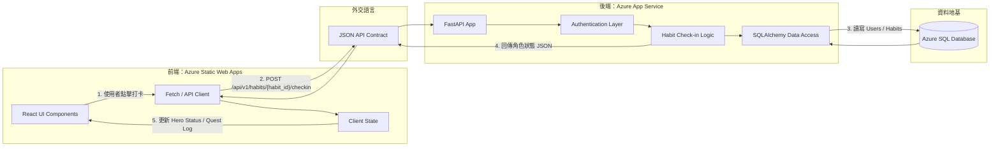

# Habit Life RPG System Architecture

版本：Chapter 4 Foundation  
狀態：工程架構藍圖  
對應書稿：第 4.1 節「系統架構圖」

## 1. 文件目的

本文件把第 3 章的產品藍圖翻成工程架構。第四章仍然不開始寫 FastAPI 或 React 程式碼，而是先定義系統邊界、資料流、技術路線與部署方向。

本章最重要的決策是：`Habit Life RPG` 採用前後端分離架構。前端負責畫面與互動，後端負責驗證、資料存取與 RPG 數值結算，雙方只透過 JSON API 溝通。

## 2. 架構原則

- 前端與後端分離，避免 UI 與商業邏輯混在同一層。
- 前端不得自行決定 EXP、gold、level、HP 等角色數值。
- 後端是伺服器權威，所有打卡、獎勵與權限判定都在後端執行。
- 本機 MVP 先使用 SQLite，雲端部署階段再升級為 Azure SQL。
- API 命名進入系統語言後一律使用 `habit` / `habits` / `habit_id`。

## 3. 本機 MVP 架構

第 5 章開始會先建立本機後端。此時不需要 Azure 資源，目標是用最小可行架構跑通打卡主循環。

### 本機階段責任

| 層級 | 責任 | 本章是否實作 |
| :--- | :--- | :--- |
| Static Prototype | 展示復古像素 RPG 風格 UI | 已於第 3 章完成 |
| React App | 正式前端狀態與 API 串接 | 第 7 章實作 |
| FastAPI Router | 接收 HTTP request 並回傳 JSON | 第 5 章實作 |
| Auth Guard | 驗證使用者身分 | 第 5 章起步，第 6 章補測試 |
| Habit Check-in Service | 判斷 habit 歸屬、重複打卡、獎勵結算 | 第 5 章實作 |
| SQLAlchemy Data Access | 存取 Users / Habits | 第 5 章實作 |
| SQLite | 本機 MVP 資料庫 | 第 5 章建立 |

## 4. 終局 Azure 架構

下圖是第 8 章部署時的目標架構，不代表第四章要立刻建立 Azure 資源。

## 5. Client-Server 資料流

以打卡主流程為例：

1. 使用者在前端點擊某個 habit 的打卡按鈕。
2. 前端呼叫 `POST /api/v1/habits/{habit_id}/checkin`。
3. 後端驗證使用者登入狀態。
4. 後端確認該 habit 屬於目前使用者。
5. 後端檢查 `Habits.LastCheckIn` 是否已經是今天。
6. 後端結算 `current_exp`、`current_gold`、`current_level` 與 `leveled_up`。
7. 前端只根據 JSON response 更新畫面，不自行計算獎勵。

## 6. 技術棧

| 類別 | 技術 | 使用時機 |
| :--- | :--- | :--- |
| Backend | FastAPI | 第 5 章開始建立本機 API |
| ORM | SQLAlchemy | 第 5 章連接 SQLite，第 8 章延伸 Azure SQL |
| Local Database | SQLite | 第 5 章本機 MVP |
| Tests | Pytest | 第 6 章驗證 API 與商業規則 |
| Frontend | React + Vite | 第 7 章建立正式前端 |
| Cloud Frontend | Azure Static Web Apps | 第 8 章部署 |
| Cloud Backend | Azure App Service | 第 8 章部署 |
| Cloud Database | Azure SQL | 第 8 章部署 |

## 7. 第四章邊界

第四章只建立架構與契約文件，不做以下事情：

- 不建立 FastAPI 專案。
- 不建立 SQLite database file。
- 不建立 Alembic migration。
- 不建立 React app。
- 不建立 Azure 資源。

這個邊界很重要。第 4 章的成果是讓第 5 章可以照文件開始施工，而不是提前把後面章節寫完。
