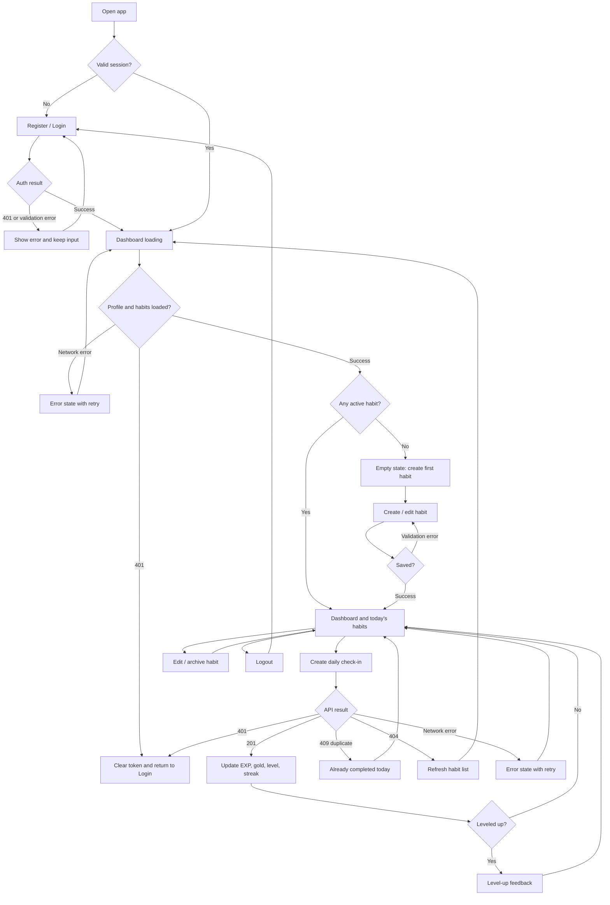

# Habit Life RPG UX Flow

這份流程涵蓋 register、login、Habit 管理、每日 Check-in 與異常恢復。

## 快樂路徑

1. Guest 完成 register 或 login。
2. Dashboard 顯示 Profile 與 Habit。
3. Member 建立第一個 Habit 或選擇現有 Habit。
4. Member 送出每日 Check-in。
5. API 回傳獎勵、Streak 與最新 Profile。
6. 前端更新資料；升級時顯示額外回饋。

## 異常與邊界

| 狀態 | UI 行為 | 資料行為 |
| --- | --- | --- |
| loading | 保留穩定骨架並停用重複提交 | 不預先修改本機數值 |
| empty | 顯示建立第一個 Habit 的主要動作 | 不建立假資料 |
| error | 顯示原因與 retry | 不顯示成功狀態 |
| `401` | 清除 Token 並回 Login | 不重送受保護操作 |
| `404` | 重新載入 Habit | 不洩漏所有權資訊 |
| `409 duplicate` | 標示今天已完成 | 不重複發放獎勵 |

## 導覽模型

Guest 只有 Auth 畫面。Member 以 Dashboard 為主畫面，從同一工作區建立、修改、封存與打卡，不加入多餘的遊戲分頁。
