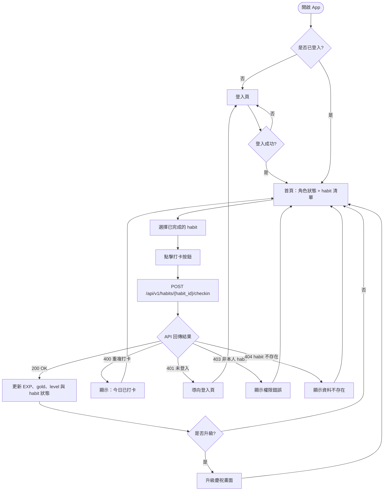

# Habit Life RPG UX Flow

版本：Chapter 3 Blueprint  
狀態：核心流程圖  
對應書稿：第 3.3 節「使用者旅程 UX Flow」

## 1. 文件目的

本文件把 `docs/user-stories.md` 中的文字規則轉成可視化流程。第三章先聚焦在「每日 habit 打卡領獎」主循環，讓後續架構、API、測試與前端畫面都能對齊同一條動線。

## 2. 核心流程

## 3. 狀態說明

| 節點 | 說明 | 後續章節用途 |
| :--- | :--- | :--- |
| `CheckLogin` | 判斷使用者是否有有效登入狀態 | 第 4 章定義驗證流程，第 5 章實作 API guard |
| `HomePage` | 顯示角色狀態與 habit 清單 | 第 7 章前端主畫面 |
| `ApiCall` | 打卡主 API | 第 4 章 OpenAPI 契約，第 5 章 FastAPI route |
| `ApiResult` | 根據 HTTP 狀態碼分流 | 第 6 章測試案例 |
| `UpdateState` | 成功後更新經驗值、金幣、等級 | 第 5 章商業邏輯，第 7 章 UI state |
| `LevelUp` | 升級時的特殊回饋 | 第 7 章前端提示狀態 |

## 4. 快樂路徑

1. 使用者開啟 App。
2. 系統確認使用者已登入。
3. 使用者在首頁看到角色狀態與 habit 清單。
4. 使用者點擊某個 habit 的打卡按鈕。
5. 前端呼叫 `POST /api/v1/habits/{habit_id}/checkin`。
6. 後端回傳 `200 OK` 與更新後數值。
7. 前端更新畫面。
8. 若升級，顯示升級慶祝畫面；若未升級，回到首頁。

## 5. 主要異常路徑

| 狀態碼 | 情境 | UI 反應 |
| :--- | :--- | :--- |
| `400 Bad Request` | 同一個 habit 今天已經打卡 | 顯示「今日已打卡」訊息，不更新成功狀態 |
| `401 Unauthorized` | 使用者未登入或 session 失效 | 導向登入頁 |
| `403 Forbidden` | habit 不屬於目前使用者 | 顯示權限錯誤，不更新角色數值 |
| `404 Not Found` | habit 不存在 | 顯示資料不存在，不更新角色數值 |

## 6. 本章邊界

此流程圖只定義產品行為與畫面動線，不代表第 3 章已經實作登入、API、資料庫或前端互動。正式系統設計會在第 4 章展開。
